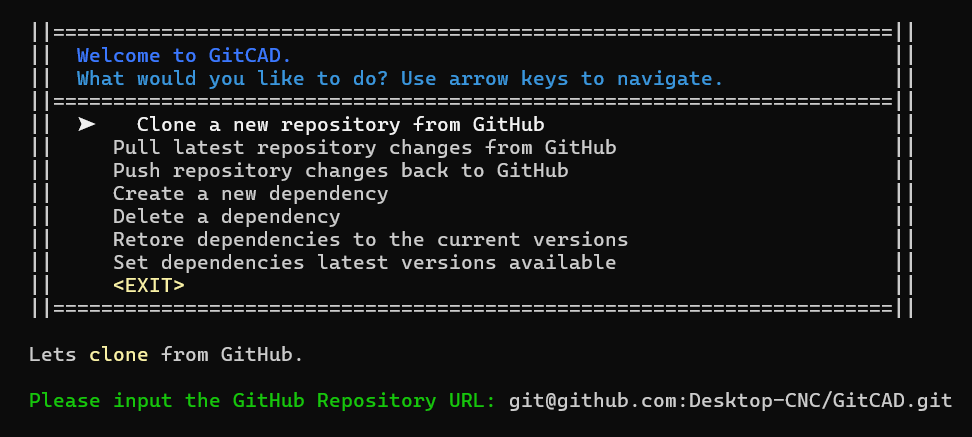
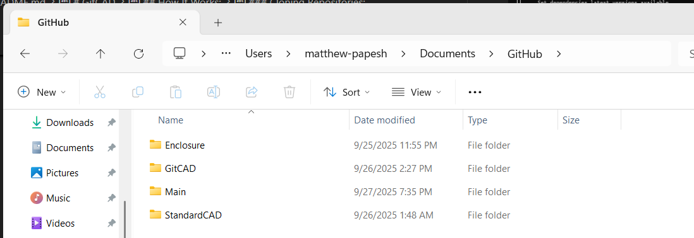
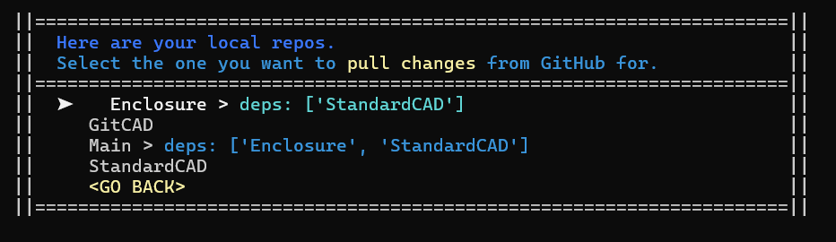

# GitCAD 
GitCAD is a tool that will manage GitHub CAD repositories on a local machine and allow a user to import one CAD repository into another. This allows CAD assemblies to be developed on independent repositories while keeping assemblies connected across repositories.  

## Overview 
_GitCAD_ is an application that makes uploading (pushing) changes and downloading (pulling) changes from a repository easier. There are tools that do this already, such as _GitHub Desktop_. However, **_GitCAD_** allows for **declaring repositories has dependencies of another.** 

_GitCAD_ allows you to create separate CAD assemblies in different repositories to keep them independent. This is useful for keeping CAD documentation modular. Dependencies essentially serve as CAD sub-assemblies that are stored independently. 

## Benefits
Any CAD project or assembly can be made of many other assemblies; typically known as sub-assemblies. Should these all exist in one single repository, only one developer can make changes to that repository at a time. Otherwise, many developers will overwrite each other's work, or merge conflicts between changes made by different developers will arise. Merge conflicts can be handled for debugging software, but debugging raw CAD files is not practical. 

For these reasons, merge conflicts should be avoided entirely and so should having more than one developer working on a CAD repository at a time.

A **dependency** is a repository that is needed for another parent repository. This allows on one repository to depend and and import another. When resolving conflicting changes and merge conflicts should be avoided, the work across a larger project can be split across many repositories that have dependencies to others. 

## Available Distributions:
_GitCAD_ has been developed for both Linux and Windows systems. These can be found here: (can also be found in folder `/executables`)
- <a href="./executables/GitCAD_Linux"><strong>GitCAD_Linux</strong></a>
- <a href="./executables/GitCAD_Win64.exe"><strong>GitCAD_Win64.exe</strong></a>

## How It Works:
### Overview:
The app is a menu that is navigated with `UP`/`DOWN` **arrow keys** and by selecting `ENTER`. **The program allows you to do the following:**
- Clone / Push / Pull Repositories 
- Create / Delete **Depdendencies** 
- Restore Dependencies to their current version
- Update Dependencies to their latest available version

    

These abilities of _GitCAD_ that were listed can be seen above in the _GitCAD_ menu. Pressing `ENTER` on the clone option will give the prompt at the bottom of the screen. 

### Cloning Repositories:
**An http or ssh URL is needed from GitHub that is pasted in here. This clones a repository on your computer at `/Documents/GitHub` folder**

    

Seen in the image above, all repositories are downloaded (cloned/pulled) into the `/Documents/GitHub` folder. 

All other options on the menu will use the repositories already downloaded to your computer. You can use just _GitCAD_ menu after cloning for everything else.

### Pushing / Pulling Repositories:
Once cloned to the computer, pushing and pulling are the main ways to use your repository. Pushing is the action of uploading changes back to GitHub. This requires an update message explaining the change. Pulling is the action of downloading the repository from GitHub to your computer. Pulling allows you to get the most recent copy of a repository on your computer. 

### Adding / Deleting Dependencies:
A repository can have dependencies. A dependency is another repository. This allows a repository to include/import/depend on another. Looking at the _GitCAD_ main menu, a dependency can be added or deleted. Both actions will ask for two repositories, (1) the repo, and (2) the dependency. 

### Dependency Version Control: 
A dependency is downloaded with the parent repository it belongs to as one whole package. All dependencies will exist in the repository folder under the `/deps` folder. You can **restore** a dependency to the current version on the parent repository. This is so that if you make changes to the dependency to test something, etc, on your computer, you can reset the dependency to its initial state. 

The dependency will have more than one version. Especially since it also is a repository that also receives updates on GitHub. However, the version of the dependency connected to a parent repository does not change automatically. 

**If Enclosure v1.5** repository has a dependency of **STD CAD**. This dependency is on version v1.1. Then it gets an update and becomes v1.2, the **Enclosure v1.5** still has **STD CAD v1.1** **, and NOT the new version v1.2** Under **Enclosure v1.5** you can **Set dependencies latest versions available** on the _GitCAD_ main menu. This will set the dependency from **v1.1** to **v1.2** so **Enclosure v1.5** has **STD CAD v1.2** and gets the update. 

You can either restore the dependency of a repository to the current version or it can be updated to a later version if there is one on GitHub. 

### Viewing Repositories:
For most things you can do with _GitCAD_, you are needing to choose a repository. (i.e. choosing a repository to pull) For most of these choices on the main menu, click them will load a new menu with a prompt. **A repository must be cloned to your computer to use it in any way**. This is because _GitCAD_ only loads repositories found in your `/Documents/GitHub` folder on your computer. 

    

In addition to loading all repositories in the `Documents/GitHub` folder, you can also view which repositories are dependencies for another. **All repositories will look like: "NAME" > deps [dep1, dep2, ...]`. If the repository has dependendencies, they will also be listed (i.e. dep1, dep2, ...). 

In the image above, you can see `Enclosure` and `Main` are listed repositories both have dependencies. `Main` has dependencies of: `Enclosure`, and `StandardCAD`. 

Also, `Enclosure`, as its own repository has `StandardCAD` also as a dependency in the same way `Main` does. If a repository has no dependencies, none will be listed after its name. For example, `GitCAD` in the image above has no dependencies. 
