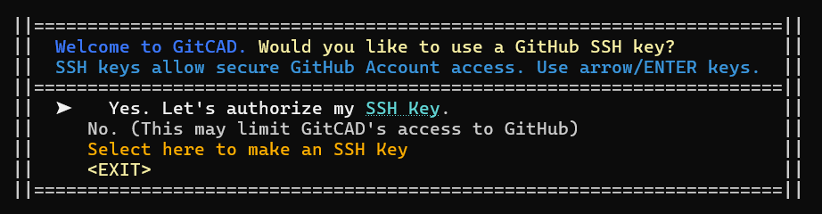
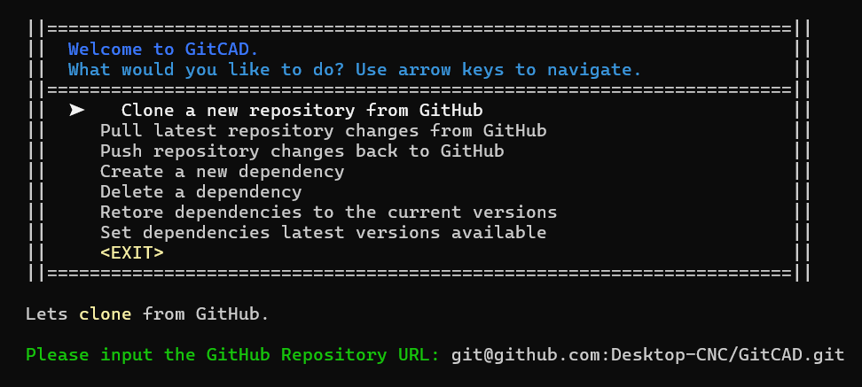
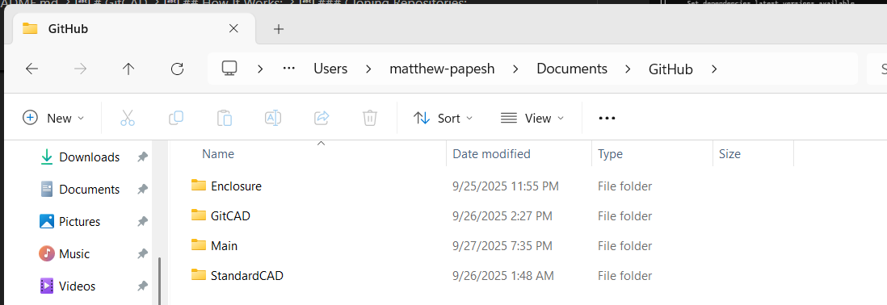

# GitCAD 
GitCAD is a tool that will manage GitHub CAD repositories and allow a user to import one CAD repository into another. This allows CAD assemblies to be developed on independent repositories while keeping assemblies connected across repositories.  

## Overview 
_GitCAD_ is an application that makes uploading (pushing) changes and downloading (pulling) changes from a repository easier. There are tools that do this already. However, **_GitCAD_** allows for **declaring repositories has dependencies of another.** 

_GitCAD_ allows you to create separate CAD assemblies in different repositories to keep them independent. This is useful for keeping CAD documentation modular. Dependencies essentially serve as CAD sub-assemblies that are stored independently. 

## Benefits
Any CAD project stored in one repository means only one person can make changes and work on it at a time. This is because if many people work on that repository in only one shared branch, they will overwrite each other's work. This can also lead to conflicts merging the different versions from each person. Merge conflicts can be handled for software, but debugging raw CAD files is not practical. 

For these reasons, merge conflicts should be avoided entirely for CAD, and so should having more than one person working on a CAD repository at a time.

A **dependency** is a repository that is needed by another parent repository. This allows on one repository to depend and and import another. This strategy allows many people to work on separate repositories to avoid merge conflicts, while still keeping each repository, and the project, connected. 

## Available Downloads:
_GitCAD_ has been developed for both Linux and Windows systems. These can be found here: (can also be found in folder `/downloads`)
- <a href="./downloads/GitCAD_Linux_v1.2"><strong>GitCAD_Linux v1.2</strong></a>
- <a href="./downloads/GitCAD_Win64_v1.7.exe"><strong>GitCAD_Win64.exe v1.7</strong></a>

## Setting up GitCAD:
### Install Git:
Git is a tool that allows your computer talk to and communicate with GitHub. This is required to run GitCAD. You can install Git from here: https://git-scm.com/install/
### Enable Windows to Use SSH Agent:
This step is only needed for running on Windows. Windows has a tool that will manage your SSH key for you, and it is needed to allow GitCAD to authenticate your SSH key. You can **open Windows PowerShell as ADMINISTRATOR** and run the following commands: 
```bash
sc.exe config ssh-agent start=auto 
Start-Service ssh-agent 
git config --global core.sshCommand "C:/Windows/System32/OpenSSH/ssh.exe"
```
### Creating an SSH Key:
An SSH key can be created on your computer. This key will then be uploaded to your GitHub account under your account settings. After opening _GitCAD_, you will be prompted to authorize your SSH key with the program. You can see this below: 
<div>
    
</div>

Notice that **an SSH key can be made by GitCAD**. The SSH authorization menu will allow you to create an SSH key if you don't already have one. You can walk through that process if needed. **Making an SSH key only needs to be done once**. 

Alternatively, you can make an SSH key without _GitCAD_. This can be done by following the tutorials here: 
- Create an SSH Key: https://docs.github.com/en/authentication/connecting-to-github-with-ssh/generating-a-new-ssh-key-and-adding-it-to-the-ssh-agent
- Add an SSH Key to GitHub: https://docs.github.com/en/authentication/connecting-to-github-with-ssh/adding-a-new-ssh-key-to-your-github-account

### Using an SSH Key:
Recalling the _GitCAD_ authorization menu in the image above, you can **authorize an SSH key for the program to use**. This can be done if there is an SSH key already existing. Some commands run by _GitCAD_ may need secure access to GitHub, and that is what SSH key is needed for.

Authorizing an SSH key at the starting menu requires you to give the passphrase/password of the key. Doing this at the starting menu prevents _GitCAD_ from needing to ask you again. Otherwise, without authorization, _GitCAD_ may constantly ask and will not remember the SSH key. 

## How To Use GitCAD:
### Overview:
The app is a menu that is navigated with `UP`/`DOWN` **arrow keys** and by selecting `ENTER`. **The program allows you to do the following:**
- Clone / Push / Pull Repositories 
- Create / Delete **Depdendencies** 
- Restore Dependencies to their current version
- Update Dependencies to their latest available version

<div>
    
</div>

These abilities of _GitCAD_ that were listed can be seen above in the _GitCAD_ menu. Pressing `ENTER` on the clone option will give the prompt at the bottom of the screen. 

### Cloning Repositories:
**An http or ssh URL is needed from GitHub that is pasted in here. This clones a repository on your computer at `/Documents/GitHub` folder**

<div>
    
</div>

Seen in the image above, all repositories are downloaded (cloned/pulled) into the `/Documents/GitHub` folder. 

All other options on the menu will use the repositories already downloaded to your computer. You can use just _GitCAD_ menu after cloning for everything else.

### Pushing / Pulling Repositories:
Once cloned to the computer, pushing and pulling are the main ways to use your repository. Pushing is the action of uploading changes back to GitHub. This requires an update message explaining the change. Pulling is the action of downloading the repository from GitHub to your computer. Pulling allows you to get the most recent copy of a repository on your computer. 

### Adding / Deleting Dependencies:
A repository can have dependencies. A dependency is another repository. This allows a repository to include/import/depend on another. Looking at the _GitCAD_ main menu, a dependency can be added or deleted. Both actions will ask for two repositories, (1) the repo, and (2) the dependency. 

### Dependency Version Control: 
A dependency is downloaded with the parent repository it belongs to as one whole package. All dependencies will exist in the repository folder under the `/deps` folder. You can **restore** a dependency to the current version on the parent repository. This is so that if you make changes to the dependency to test something, etc, on your computer, you can reset the dependency to its initial state. 

The dependency will have more than one version. Especially since it also is a repository that also receives updates on GitHub. However, the version of the dependency connected to a parent repository does not change automatically. 

**If Enclosure v1.5** repository has a dependency of **STD CAD**. This dependency is on version v1.1. Then it gets an update and becomes v1.2, the **Enclosure v1.5** still has **STD CAD v1.1** **, and NOT the new version v1.2** Under **Enclosure v1.5** you can **Set dependencies latest versions available** on the _GitCAD_ main menu. This will set the dependency from **v1.1** to **v1.2** so **Enclosure v1.5** has **STD CAD v1.2** and gets the update. 

You can either restore the dependency of a repository to the current version or it can be updated to a later version if there is one on GitHub. 
